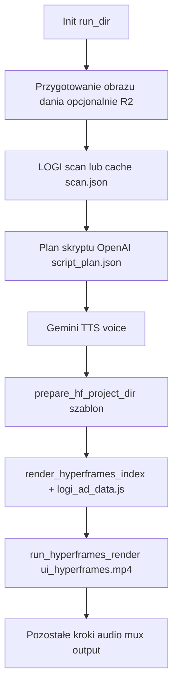
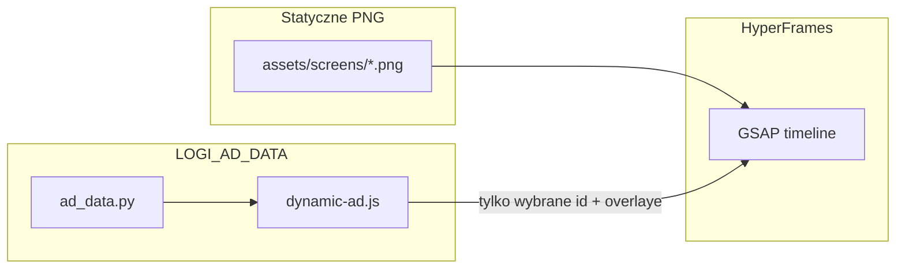

# Roadmap: szablon HyperFrames bez screenshotów (dla zewnętrznego agenta)

Ten plik ma służyć **razem z repozytorium** jako kontekst dla narzędzi typu ChatGPT 5.5 / Imagine przy generowaniu **kodu HTML/CSS** i ewentualnie **grafik tła** (bez fałszywych UI z konkretnymi liczbami posiłku).

**Ścieżki w tym dokumencie** — przyjmij **root git** katalogu `vieo` (folder z `pyproject.toml`). Jeśli kopiujesz plan poza repo, prefiksuj wszystkie ścieżki nazwą folderu projektu.

**Zasady dla agentów generujących kod**

- Jedna prawda danych: **`window.LOGI_AD_DATA`** (budowane w Pythonie z wyniku LOGI + planu skryptu) — UI w „telefonie” czyta z tego obiektu; **nie** duplikować liczb w PNG.
- Kontrakt HyperFrames: `docs/agents/HYPERFRAMES_CONTRACT.md`, oficjalnie [HTML schema / GSAP](https://hyperframes.heygen.com/reference/html-schema).
- **Imagine / image gen:** nadaje się do **gradientów, tekstur, ilustracji marketingowych poza telefonem**; pełny „ekran aplikacji” z właściwymi makrami = **HTML**, nie bitmapa z API.

---

## API LOGI — co zwraca i jak trafia do szablonu

Pełny opis integracji: `LOGI_API.md`. Schematy JSON: `schemas/logi-scan-request.schema.json`, `schemas/logi-scan-response.schema.json`.

| Etap | Opis |
|------|------|
| Żądanie | `POST` na `logi.base_url` z `config.yaml` (domyślnie demo scan); nagłówek `x-api-key`; ciało: `lang` + **albo** `prompt` **albo** `image_url` — `src/logi_client.py` → `build_scan_payload`. |
| Odpowiedź | JSON walidowany jako `ScanResponse`: `success`, `scanId`, `data`, … — `src/models/scan.py`. |
| Model domenowy | `MealScan.from_api_data(data)` — m.in. `mealName` → `meal_name`, `ingredients[]`, `potentialHealthRisks`, `nutritionistsOpinion`, sumy w `NutritionTotals`. |
| Artefakt runu | Surowy wynik: `artifacts/<run>/scan.json`. |

Składnik w API (`ingredients[]`): m.in. `name`, `description`, `weight`, `category`, `nutritional_reference`, `nutritional_actual`, `thumbnail_url` — wartości odżywcze mapowane do pól typu kalorie, GL, GI itd. (szczegóły w `LOGI_API.md` §5).

**HyperFrames nie woła LOGI** — widzi tylko to, co pipeline zapisał do `MealScan` i przekazało do `build_logi_ad_data`.

---

## Pipeline vieo — kolejność (gdy `render.ui_backend: hyperframes`)

Implementacja: `src/pipeline.py` — funkcja `run_pipeline()`.

1. **`_init_run_dir`** — katalog `artifacts/<timestamp>/`.
2. **`_prepare_dish_image`** — generacja / cache obrazu, upload R2 opcjonalnie.
3. **`_load_or_scan`** — LOGI lub wczytanie cache → `(ScanResponse, MealScan)`; zapis `scan.json`.
4. **`create_script_planner`** — `ScriptPlan` → `script_plan.json` (segmenty TTS / copy).
5. **`create_tts_engine`** — plik głosu, `voice_duration_sec` z `ffprobe`.
6. **Jeśli `hyperframes`:**  
   - `src/render_hyperframes.py` → `prepare_hf_project_dir` — kopiuje `hyperframes-commercial-app-ad/` → `artifacts/.../hf_project/`.  
   - `render_hyperframes_index` — zapisuje `hf_project/assets/logi_ad_data.js` (`window.LOGI_AD_DATA` + alias `__LOGI_AD_DATA__`), kopiuje `gsap.min.js`, `dynamic-ad.js`, wstrzykuje skrypty do `hf_project/index.html`.  
   - `src/hyperframes_runner.py` → `run_hyperframes_render` — `npx hyperframes render ...`.
7. Dalsze kroki: normalizacja wideo, mux z audio, plik końcowy (np. `output/`).

Smoke bez LOGI: `src/hyperframes_smoke.py` — `_dummy_meal_scan()` zamiast API.

---

## `LOGI_AD_DATA` — kształt payloadu (z `src/ad_data.py` → `build_logi_ad_data`)

Plik wyjściowy w projekcie HF: `hf_project/assets/logi_ad_data.js` — jedna globalna zmienna JSON.

| Klucz | Typ / znaczenie |
|-------|------------------|
| `language` | string |
| `dish` | string (fallback: nazwa posiłku) |
| `food_image` | `{ asset, nested_asset, public_url }` — ścieżka względna do `hf_project` lub URL publiczny miniatury |
| `meal` | `{ name, description, primary_opinion }` |
| `metrics` | `{ glycemic_load: { value, raw, band }, calories, carbs, fat, protein, sugars?, saturated_fat? }` — **sumy z `MealScan.totals`**, GL składników sumowane w `_sum_actual` |
| `ingredients` | tablica max 8 obiektów: `name`, `description`, `category`, `weight`, `calories`, `carbs`, `fat`, `protein`, `glycemic_index`, `glycemic_load`, `thumbnail_url` |
| `risks` | tablica stringów (max 3) |
| `insights` | tablica stringów (max 4, opinie dietetyczne) |
| `script` | `{ hook_line, sections: { section_id: narration_text } }` |
| `cta` | stałe stringi nagłówka / CTA (na razie nie z LLM per-run poza resztą planu) |

Runtime w przeglądarce: `assets/hyperframes/dynamic-ad.js` (w runtime: `hf_project/assets/dynamic-ad.js`) — `apply()` ustawia `textContent` / `src` po znanych `id` oraz może doklejać DOM (`ensureLiveCard`, `ensureNutritionPanel`). Przy przejściu na HTML: **preferuj** `data-logi-field="metrics.calories"` + jeden renderer albo rozszerzenie `apply()` o `querySelectorAll('[data-logi-...]')`.

---

## Mapa plików (co edytować / co podać agentowi)

| Rola | Ścieżka |
|------|---------|
| Szablon HyperFrames (sceny, GSAP, CSS w kompozycjach) | `hyperframes-commercial-app-ad/` — `index.html`, `compositions/*.html`, `assets/` |
| Payload UI | `src/ad_data.py` |
| Wstrzyknięcie HF + kopia szablonu | `src/render_hyperframes.py` |
| CLI render | `src/hyperframes_runner.py`, `config.yaml` → `hyperframes.*` |
| Kontrakt agentów | `docs/agents/HYPERFRAMES_CONTRACT.md` |
| Wzorzec „dużo HTML, mało PNG” | `hyperframes-meal-detail-template/hyperframes-meal-detail-template/` |

---

# Plan: UI bez screenshotów + dane z LOGI (strukturalnie)

## Jak działa szablon **teraz** (źródło „zbugowania”)

1. **Większość „aplikacji” w telefonie to pliki PNG** w [`hyperframes-commercial-app-ad/assets/screens/`](hyperframes-commercial-app-ad/assets/screens/) — np. `app-add-empty.png`, `app-add-filled.png`, `app-add-loading.png`, `app-journal-result.png`. Są to **nagrania / eksporty UI** z realnym paskiem statusu, tekstem „Burger…”, stałymi liczbami itd. ([`assets/README.md`](hyperframes-commercial-app-ad/assets/README.md) to potwierdza.)

2. **HyperFrames** w każdej kompozycji traktuje te `` jak warstwy wideo: `data-start` / `data-duration` / **GSAP** (`opacity`, `y`, `scale`) nakłada animację na **bitmapę**, której treści **nie zmienia** API.

3. **Dynamiczna warstwa** to `assets/hyperframes/dynamic-ad.js` + payload z `src/ad_data.py` (`build_logi_ad_data` → `logi_ad_data.js`):
   - Podmieniane są **konkretne** `textContent` po `id` (np. `scan-subline`, `results-caption`) i **`src` tylko dla** `#hook-food-image`.
   - Dodawane są **nakładki DOM** (`#dynamic-journal-card`, `#dynamic-nutrition-panel`) z **inline** pozycjami — stąd kolizje liczb (**GL na PNG vs GL z metryk** w wynikach / nutrition): **dwa źródła prawdy** (bitmapa vs `LOGI_AD_DATA.metrics`).

**Wniosek:** żeby „nie brać screenów” w sensie produktowym, **nie wystarczy** dopiąć API do obecnych PNG — trzeba **zastąpić** (lub stopniowo wycinać) warstwę PNG **markupem HTML** powiązanym z danymi.

---

## Cel docelowy (Twój wybór: **strukturalnie**)

- **Obszar „ekranu telefonu”** (prostokąt wewnątrz ramki) = **HTML + CSS** (jak w [`hyperframes-meal-detail-template/.../compositions/`](hyperframes-meal-detail-template/hyperframes-meal-detail-template/compositions/) — tam UI jest głównie z `div`/`span`, a zdjęcie to jeden `img` hero, nie cały systemowy screenshot).
- **Dane** z `MealScan` / totals / ingredients → już są w `build_logi_ad_data` (`src/ad_data.py`); rozszerzysz kontrakt JSON (np. `screen_scan`, `screen_journal`) albo **tylko DOM**: `data-logi-*` + jeden renderer w `dynamic-ad.js` (lub osobny `phone-ui.js`), **jedna prawda** dla liczb i nazw dania.
- **Pasek statusu telefonu**: znika naturalnie, bo **nie renderujesz** go w HTML (albo maska tylko na czas migracji hybrydowej).

---

## Fazy implementacji (zalecane)

### Faza 0 — Ustalenie „telefonu” jako komponentu

- Wspólny wrapper w każdej scenie: `phone-chrome` (ramka, cień) + `phone-viewport` (overflow hidden, **tylko** treść appki).
- Wspólne tokeny w [`index.html`](hyperframes-commercial-app-ad/index.html) lub jednym pliku stylów importowanym koncepcyjnie (kopiowanie fragmentu do każdej kompozycji na start — HyperFrames bez bundlera).

### Faza 1 — **add-meal** (Step 1) jako wzorzec

Plik: [`compositions/add-meal.html`](hyperframes-commercial-app-ad/compositions/add-meal.html).

- Usunąć lub zminimalizować użycie `add-screen-empty` / `add-screen-filled` **PNG** na rzecz HTML (puste pole, przyciski Meal/Activity/Sleep, FAB +).
- GSAP: sekwencja **pusty stan → focus na + / polu → wypełnienie** przez `text()` / `src` na jednym `` miniatury z `food_image` z payloadu (już jest w `LOGI_AD_DATA`).
- To adresuje: „puste UI, plus, dopiero podpis dania” — logika **tu**, nie w `scanning`, jeśli narracja to „najpierw dodaj posiłek”.

### Faza 2 — **scanning** (Step 2)

Plik: [`compositions/scanning.html`](hyperframes-commercial-app-ad/compositions/scanning.html).

- Zastąpić `#scan-screen` (`app-add-loading.png`) **neutralnym tłem HTML** (gradient + szkielet listy) albo **jednym** `img` tylko jako subtelny wzorzec bez status bara — bez tekstu „Burger…”.
- Chipsy (`scan-chip-*`) już są `span` — podłączyć do `meal.name`, `ingredients[0].name`, `glLabel` z `dynamic-ad` (nowe `id` lub `data-logi-*`).
- Ułożyć **pionowo**: step pill, headline, subline **powyżej** strefy „mock app”, żeby nie kolidowały z HTML listy (obecny overlap wynika z PNG + pozycji `top` + braku miejsca).

### Faza 3 — **results** + usunięcie konfliktu danych

Plik: [`compositions/results.html`](hyperframes-commercial-app-ad/compositions/results.html) + [`dynamic-ad.js`](assets/hyperframes/dynamic-ad.js).

- Zamiast `app-journal-loading.png` / `app-journal-result.png`: **lista dziennika w HTML** (karta z `food_image`, nazwa z `meal.name`, makra z `metrics`).
- **Usunąć lub przenieść** `ensureLiveCard()` jeśli duplikuje journal — inaczej znów dwa zestawy liczb.
- Ramka „shopping list” / podświetlenie: **CSS** na kontenerze HTML, pozycje liczone względem `phone-viewport`, nie względem statycznego PNG.

### Faza 4 — **nutrition**, **ingredients**, **insights**, **cta**

- Każda scena: identyczny wzorzec — **treść w HTML**, GSAP tylko animuje kontenery.
- [`nutrition.html`](hyperframes-commercial-app-ad/compositions/nutrition.html): dziś dwa PNG + overlaye z `dynamic-ad` — scalić do jednej tabeli makro z `LOGI_AD_DATA.metrics` i ingredientów jeśli potrzeba.

### Faza 5 — Payload i kontrakt

- Rozszerzyć [`build_logi_ad_data`](src/ad_data.py) tylko tam, gdzie brakuje pól (np. skrót nazwy, lista „recent” jeśli kiedykolwiek potrzebna — inaczej nie pokazuj fałszywych „recent” z PNG).
- Opcjonalnie: typ TypeScript nie ma — trzymać spójność z [`docs/agents/HYPERFRAMES_CONTRACT.md`](docs/agents/HYPERFRAMES_CONTRACT.md) (bez `setInterval` w animacjach; `dynamic-ad` już uproszczony wcześniej).

### Faza 6 — Assety

- PNG w `assets/screens/` stają się **opcjonalne** (tylko tło marketingowe poza telefonem / przejścia). Możesz przygotować **grafiki bez UI** (tło, tekstura, blur) — **nie** pełne screenshoty appki z LOGO konkretnego posiłku.
- **Hook** zostaje na razie (wg Ciebie wygląda dobrze); ewentualnie jedna podmiana hero na `food_image` już jest.

---

## Ryzyka i zależności

- **Czas / rozmiar diffu:** pełna zamiana wszystkich scen to duży refaktor; sensownie robić **scenę po scenie** i robić `lint` + `preview` + krótki `render` po każdej.
- **Pixel-perfect vs szybkość:** HTML nie musi być 1:1 z obecnym PNG — akceptacja wizualna z marketingiem.
- **HyperFrames:** nadal `class="clip"` na widocznych elementach sterowanych czasem; rooty kompozycji — trzymać zgodność z lintem 0.4.x (`data-start`/`data-duration` na rootach plików zewnętrznych, jak ustaliliśmy wcześniej).

---

## Kryterium ukończenia

- W `preview` / MP4: **brak** systemowego paska statusu w treści „telefonu”.
- Step 1 / 2: **pusty** stan na początku timeline, potem pojawia się nazwa / miniatura z **tego samego** `LOGI_AD_DATA` co reszta reklamy.
- Results / nutrition: **jedna** spójna prezentacja liczb zgodna z obrazem jedzenia i `meal_scan`.
