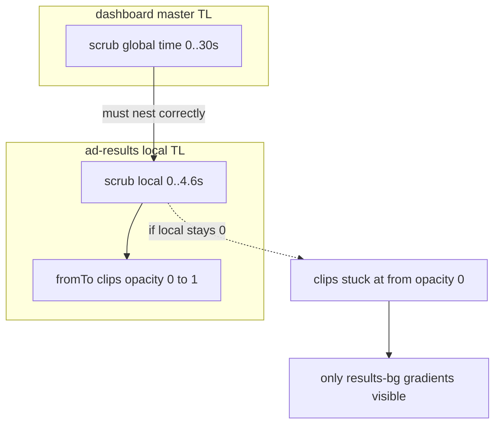

# Diagnoza: HyperFrames — animacje są, UI aplikacji nie

## Rozstrzygnięcie po testach A/B (aktualizacja)

- **Wykluczone:** literówka `data-composition-id` / `window.__timelines[...]` (m.in. ad-scanning, ad-results); ręczne `play` / `pause` / `currentTime` / `seek` / `time()` / `add(window.__timelines...)`.
- **Najbardziej prawdopodobna przyczyna (potwierdzona A/B):** pełnoekranowe warstwy `*-bg` w zagnieżdżonych kompozycjach **przykrywały** telefon, PNG i teksty, bo szablon commercial **nie wymuszał jawnego `z-index`** dla `.clip` zgodnie z kolejnością `data-track-index`. Dokumentacja sugeruje, że wyższy track jest „z przodu”, ale w renderze **0.4.17** efekt był odwrotny do oczekiwań wizualnych. Same ścieżki, usunięcie root `data-*`, `immediateRender: false` ani **hyperframes@0.4.20** nie usunęły objawu.

### Wprowadzony minimalny patch (repo)

| Obszar | Zmiana |
|--------|--------|
| `hyperframes-commercial-app-ad/index.html` | Jawny `z-index` dla `.composition-slot .clip[data-track-index="…"]` (oraz istniejące `#…-slot`), żeby tła nie zasłaniały treści. |
| `hyperframes-commercial-app-ad/compositions/*.html` | Ścieżki assetów **`../assets/...`** (spójność z dokumentem hosta po merge). |
| `src/render_hyperframes.py` | `_inject_dynamic_scripts()`: prefix `./assets` vs `../assets` wg `html_path.parent.name == "compositions"`; **`logi_ad_data.js` + `dynamic-ad.js` tylko w `index.html`** — bez wstrzykiwania do każdego `compositions/*.html` (koniec podwójnego `apply()`). |

- **Root `data-start` / `data-duration`:** **zostają** — `hyperframes@0.4.17 lint` ostrzega, że ich brak może psuć playback; niespójność z dokumentacją online świadomie zaakceptowana do czasu pinu/upgrade CLI i ponownej walidacji.

### Weryfikacja statyczna (PowerShell)

- Brak `src="./assets/'` w `compositions/*.html`.
- Brak wzorców `.play(`, `.pause(`, `currentTime`, `.add(window.__timelines`, `seek(`, `time(` w tych plikach.

### Do zrobienia lokalnie (poza sandboxem)

```text
cd hyperframes-commercial-app-ad
npx hyperframes@0.4.17 lint
npx hyperframes@0.4.17 render --output ..\artifacts\commercial-fixed.mp4 --fps 30 --quality draft
```

Pełnego renderu po finalnym patchu nie powtórzono w środowisku z limitem zgód — **wymagane potwierdzenie wizualne** na Twojej maszynie.

### Powiązane pliki (sesja review)

`hyperframes-commercial-app-ad/index.html`, `hyperframes-commercial-app-ad/compositions/*.html`, `src/render_hyperframes.py`, `src/ad_data.py`; kandydat testowy: `artifacts/hf_candidate_css_scan/` (jeśli nadal w repo).

---

Poniżej: **archiwum pierwotnej analizy** (GSAP „from”, child timeline, konflikt `data-*` z docs) — część argumentów nadal edukacyjna, ale **główny fix w kodzie to stacking + ścieżki + jeden inject**.

## Co widać w projekcie (dowody z kodu)

1. **Ścieżki assetów w ostatnim smoke** — w [artifacts/hyperframes_smoke_20260424_152734/hf_project/compositions/hook.html](c:/Users/wikid/Desktop/vieo/artifacts/hyperframes_smoke_20260424_152734/hf_project/compositions/hook.html) obrazy mają `src="./assets/..."`; [logi_ad_data.js](c:/Users/wikid/Desktop/vieo/artifacts/hyperframes_smoke_20260424_152734/hf_project/assets/logi_ad_data.js) ma `assets/generated_food_image.png`. To jest spójne z dokumentem `hf_project/index.html` — **nie** wygląda na błąd `../assets` w tym buildzie.

2. **Wzór wizualny z screenów** (miękkie plamy zieleni / różu / szarości) bardzo przypomina **warstwy tła** z CSS, np. `#results-bg` w [compositions/results.html](c:/Users/wikid/Desktop/vieo/hyperframes-commercial-app-ad/compositions/results.html) (dwa `radial-gradient` + `#f4f4f3`) albo `#hook-image-warmth` w hooku — a **nie** ramkę telefonu ani PNG ekranu.

3. **Kluczowa mechanika scen** — w [results.html](c:/Users/wikid/Desktop/vieo/artifacts/hyperframes_smoke_20260424_152734/hf_project/compositions/results.html) GSAP startuje m.in. z:
   - `tl.fromTo(..., "#results-screen-loading", "#results-screen-final", ... { opacity: 0, ... }, { opacity: 1, ... }, 0);`
   Przy **globalnym czasie zagnieżdżonej kompozycji zatrzymanym na 0** (albo gdy runtime nie „scrubuje” child timeline w sync z masterem) obowiązuje stan **„from”** — czyli **`opacity: 0`** na obrazach telefonu. Wtedy w kadrze zostaje głównie **tło** (`#results-bg` itd.) — dokładnie opis „gradientów bez UI”.

4. **Konflikt dokumentacji vs. obecny markup** — oficjalny [HTML Schema / GSAP Animation](https://hyperframes.heygen.com/reference/html-schema) mówi, że długość kompozycji wynika z `tl.duration()`, a na **elemencie z `data-composition-src`** nie stosuje się `data-duration` w ten sam sposób co na img. W repo jednocześnie:
   - [hyperframes-commercial-app-ad/VALIDATION.md](c:/Users/wikid/Desktop/vieo/hyperframes-commercial-app-ad/VALIDATION.md) (checklist bez `data-duration` na rootach zagnieżdżeń),
   - a na rootach w `compositions/*.html` są **`data-start="0"` + `data-duration="…"`** (dodane pod `hyperframes lint`).
   To **może** wpływać na to, jak `@hyperframes/core` liczy czas / nesting child timeline względem hosta — warto to traktować jako **drugi podejrzany** po synchronizacji seek.

5. **Porównanie z działającymi szablonami** — [hyperframes-dashboard-template/.../index.html](c:/Users/wikid/Desktop/vieo/hyperframes-dashboard-template/hyperframes-dashboard-template/index.html) i [hyperframes-meal-detail-template/.../index.html](c:/Users/wikid/Desktop/vieo/hyperframes-meal-detail-template/hyperframes-meal-detail-template/index.html) też używają `class="clip composition-slot"` i GSAP na slotach; różnica: **mniej zależności od zewnętrznych PNG w slotach** (np. header to głównie CSS/div), więc nawet przy problemie z child time nadal „coś” wygląda jak UI. Commercial jest **bardzo obrazkowy** — błąd seek/opacity od razu wygląda jak „puste tło”.



## Rekomendowany plan naprawy (kolejność)

### Faza A — potwierdzenie przyczyny (bez zgadywania)

- W katalogu ostatniego `hf_project` uruchomić **`npx hyperframes@0.4.17 preview`** i w DevTools (Network) sprawdzić: status **200** dla `./assets/screens/*.png` i `./assets/hero-burger-close.jpg`.
- Jeśli obrazy 200, hipoteza **seek child timeline** zostaje główna.
- Opcjonalnie: tymczasowo w jednej kompozycji (np. `results`) ustawić **`#results-screen-loading` na `opacity: 1` w CSS** (bez `from` 0 w pierwszym tweenie) i ponownie `render` — jeśli UI „nagle” wraca, potwierdzamy zatrzymanie na stanie „from”.

### Faza B — naprawa struktury pod HyperFrames (priorytet)

1. **Ujednolicić root zagnieżdżonych kompozycji z oficjalnym kontraktem**  
   - Usunąć z rootów w `compositions/*.html` atrybuty **`data-start` / `data-duration`** (zostawić `data-composition-id`, `data-width`, `data-height` jak w przykładzie z [Compositions](https://hyperframes.heygen.com/concepts/compositions)).  
   - Długość sceny ma wynikać z **`tl.set({}, {}, X)`** w GSAP (już jest).  
   - Zaakceptować ostrzeżenia `hyperframes lint` dopóki nie zweryfikujemy, czy nowsza wersja CLI zgadza się z dokumentacją.

2. **Zmniejszyć ryzyko konfliktu „framework clip lifecycle” vs. GSAP opacity**  
   - Dla **``** rozważyć: pierwszy klatkowy stan **bez** `opacity: 0` w `fromTo` (np. animować tylko `y`/`scale`), albo — zgodnie ze schematem — sprawdzić, czy część elementów nie powinna być **bez** `class="clip"` jeśli GSAP w pełni kontroluje widoczność (to wymaga ostrożności, bo zmienia kontrakt HF).

3. **Uproszczenie skryptów dynamicznych**  
   - Dziś [render_hyperframes.py](c:/Users/wikid/Desktop/vieo/src/render_hyperframes.py) wstrzykuje `logi_ad_data.js` + `dynamic-ad.js` do **każdego** pliku w `compositions/` oraz do `index.html`. To powiela wykonanie `apply()` i obciąża DOM. Rozważyć **wstrzyknięcie tylko w `index.html`** (jedna kopia), skoro docelowy dokument to zawsze ten sam po merge.

### Faza C — jeśli nadal złe po B

- **Upgrade / pin** `hyperframes` w [config.yaml](c:/Users/wikid/Desktop/vieo/config.yaml) i sprawdzić release notes pod kątem nested timeline seek.
- Rozważyć **architekturę jak meal-detail**: jeden długi rail + scroll `y` zamiast 8 pełnoekranowych slotów ze ścisłym stackiem `z-index` — mniej ryzyka „wyższa warstwa przykrywa wszystko” i łatwiejszy debug.

## Pliki najbardziej dotknięte zmianami

- [hyperframes-commercial-app-ad/compositions/*.html](c:/Users/wikid/Desktop/vieo/hyperframes-commercial-app-ad/compositions) — root attrs + ewentualnie pierwsze tweene obrazów.
- [hyperframes-commercial-app-ad/index.html](c:/Users/wikid/Desktop/vieo/hyperframes-commercial-app-ad/index.html) — ewentualnie jedyny punkt wstrzyknięcia skryptów.
- [src/render_hyperframes.py](c:/Users/wikid/Desktop/vieo/src/render_hyperframes.py) — strategia `_inject_dynamic_scripts` (tylko index vs wszystkie kompozycje).

---

## Prompt dla Codex (copy-paste)

Poniższy blok wklej do Codex jako **jednorazowe zadanie audytu** (możesz dodać na początku ścieżkę do repo, jeśli pracuje poza kontekstem plików).

```
Kontekst: repozytorium vieo — pipeline generuje segment UI wideo przez HyperFrames CLI (Node). Aktywny szablon HyperFrames wybiera `hyperframes.project_template_dir` w config.yaml (obecnie: hyperframes-commercial-app-ad). Szablon jest kopiowany do artifacts/<run>/hf_project/ przy każdym runie; Python przygotowuje index.html, logi_ad_data.js, kopiuje gsap.min.js i dynamic-ad.js do hf_project/assets/.

Problem do zanalizowania: w renderze MP4 widać głównie tła / gradienty scen (warstwy CSS typu *-bg), a nie „telefon” z PNG ekranu aplikacji — jakby UI było niewidoczne w kadrze. Animacje timeline mogą działać, ale zawartość oparta na  z GSAP fromTo(opacity 0→1) pozostaje w stanie „from” albo child timeline zagnieżdżonej kompozycji nie jest zsynchronizowany z masterem.

Twoje zadanie:
1) Potwierdź lub obal hipotezy z dokumentu planu (ścieżki assetów 200 vs seek child timeline vs konflikt data-start/data-duration na rootach zagnieżdżeń vs podwójne wstrzyknięcie skryptów).
2) Porównaj szczegółowo DZIAŁAJĄCE szablony referencyjne z PROBLEMATYCZNYM:
   - Baseline A: hyperframes-dashboard-template/hyperframes-dashboard-template/ (index.html + compositions/*)
   - Baseline B: hyperframes-meal-detail-template/hyperframes-meal-detail-template/
   - Cel: hyperframes-commercial-app-ad/
   Szukaj różnic: root atrybuty data-* na hostowanych kompozycjach, sposób nestowania data-composition-src, pierwszy klatkowy stan opacity/visibility, użycie class="clip", głębokość PNG w slotach, z-index.
3) Sprawdź oficjalną dokumentację HyperFrames (https://hyperframes.heygen.com/ — Concepts: Compositions, Reference: HTML schema / GSAP) i zderz z VALIDATION.md w commercial oraz z faktycznym markupiem compositions/*.html.
4) Przejrzyj Python: src/render_hyperframes.py — prepare_hf_project_dir, _sync_hf_project_shared_assets, _inject_dynamic_scripts (czy wstrzyknięcie do każdego compositions/*.html jest potrzebne), _write_dynamic_ad_payload; oraz assets/hyperframes/dynamic-ad.js.
5) Zwróć: (a) najbardziej prawdopodobna przyczyna z dowodem z plików, (b) minimalny zestaw zmian A/B do weryfikacji, (c) ryzyka regresji.

Metodyka: użyj `npx hyperframes@0.4.17 preview` w skopiowanym hf_project z artifacts lub w szablonie po lokalnej zmianie; Network w DevTools dla ./assets/screens/*.png. Opcjonalnie szybki test CLI: logi-video --hyperframes-smoke (szczegóły flag w src/cli.py). Bez emoji. Pisz po polsku jeśli użytkownik po polsku.

Struktura katalogów repo (skrót orientacyjny — zweryfikuj list_dir jeśli coś się przesunęło):

vieo/
  config.yaml                 # hyperframes.project_template_dir, cli_package hyperframes@0.4.17
  pyproject.toml
  HYPERFRAMES.md
  LOGI_API.md
  assets/
    hyperframes/dynamic-ad.js # kopiowany do hf_project/assets/dynamic-ad.js
    vendor/gsap.min.js
    fonts/                      # napisy / fonty pipeline
  docs/
    components.md
    hyperframe-api.md
    patterns.md
    templates.md
  src/                          # pipeline Python (28 modułów)
    cli.py                      # m.in. --hyperframes-smoke
    pipeline.py
    render_hyperframes.py       # kopia szablonu, payload, inject skryptów
    hyperframes_runner.py       # subprocess npx hyperframes render
    hyperframes_smoke.py
    ad_data.py                  # build_logi_ad_data → logi_ad_data.js
    …
  hyperframes-commercial-app-ad/    # AKTYWNY szablon (nazwa z config)
    index.html
    README.md
    VALIDATION.md
    validate-static.js
    compositions/
      hook.html, scanning.html, add-meal.html, ingredients.html,
      nutrition.html, insights.html, results.html, cta.html
    assets/
      audio/*.wav
      screens/*.png             # PNG „ekranów” telefonu
      hero-burger-close.jpg
  hyperframes-dashboard-template/
    hyperframes-dashboard-template/
      index.html
      compositions/             # header, habits, journal-card, …
      assets/
  hyperframes-meal-detail-template/
    hyperframes-meal-detail-template/
      index.html
      compositions/             # hero, meal-insights, top-shell, …
      assets/
  hyperframes_composition/      # starszy / minimalny przykład (hyperframes.json + index)
  artifacts/                    # runy; hf_project/ pod katalogiem timestamp

Uwaga: szablony dashboard i meal-detail mają **podwójny** folder (np. …/hyperframes-meal-detail-template/hyperframes-meal-detail-template/) — to zamierzona struktura w repo, nie pomyłka w ścieżce.
```

### Uwaga przy ponownym użyciu promptu Codex

Repozytorium może już zawierać patch opisany w sekcji **Rozstrzygnięcie** (z-index na clipach, `../assets/` w podkompozycjach, inject tylko do `index.html`). Wklejając powyższy blok, dopisz na początku, żeby agent **najpierw porównał aktualny diff** i szukał ewentualnej regresji albo potwierdził pełnym `render` lokalnie — zamiast od zera powtarzać odrzucone hipotezy (opacity/seek jako główna przyczyna).
